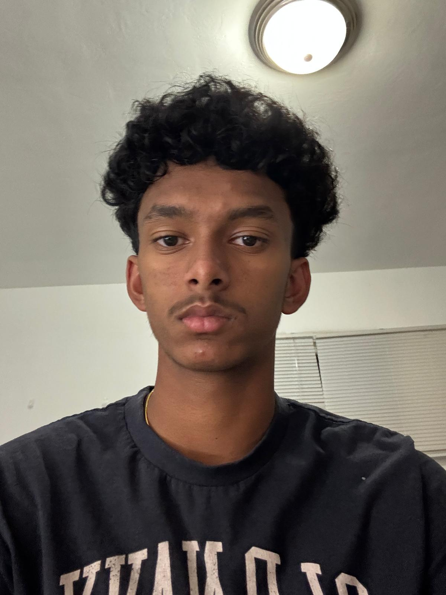
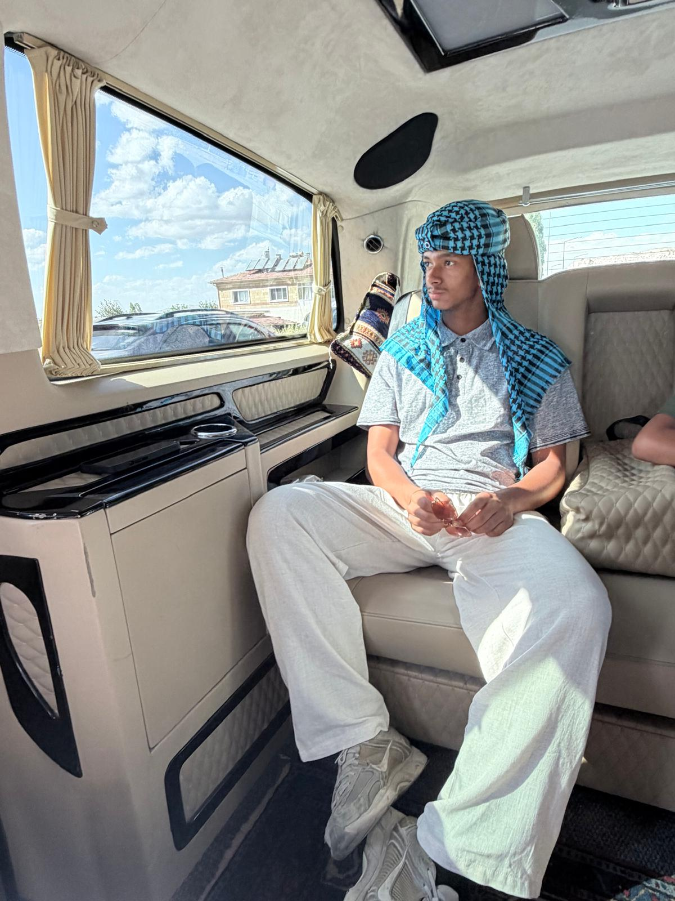

# My Personal Portfolio

Welcome to my homepage! This is where I showcase and continue to update my progress on work and projects!

## About Me

Here is some information about who I am and what I do: I am currently a sophomore at Whitney High School, currently ranked #2 in California and #11 nationally. I play cricket for NGYCA and also in SCCA up till Division 3. I have also amassed over 160+ hours of volunteering at both the Cerritos Library and the California Scholarship Federation club at Whitney which I am the CJSF liaison for as a member of the cabinet. I also work part time as the digital marketing manager for Cell Phone Repair Bellflower, El Monte, Lawndale, and Moreno Valley. I have produced 40k+ views across all platforms and continue to work on driving foot traffic to the stores. I am an aspiring business/finance student and I hope to learn more through my upcoming experiences!

## My Cricket Statistics

[Click here to check out my cricket profile](https://cricclubs.com/NGYCA/user/9DdzGwm5EfXkV5CLsNdDBg?playerName=Sridheera+Banda)

